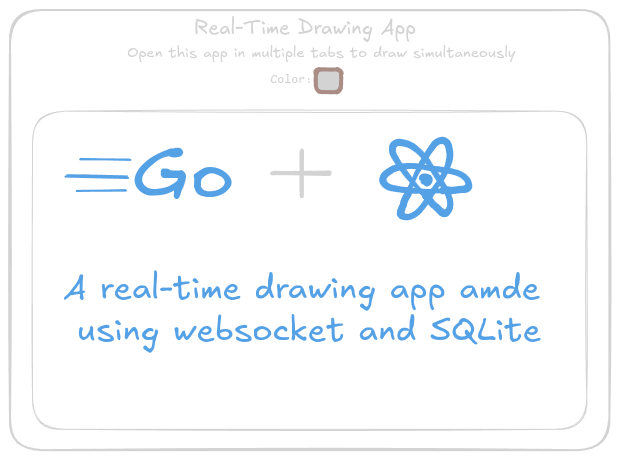

# Real-Time Drawing App

A real-time drawing application built with Go for the backend and React with TypeScript and Zustand for the frontend. The app allows users to draw collaboratively, with changes saved in SQLite.

<p align="center">

</p>

### Preview

<p align="center">

</p>

### Installation

1. Clone the repository:

   ```bash
   git clone https://github.com/maciekt07/DrawingApp.git
   cd DrawingApp
   ```

2. Install backend dependencies and run the server:

   ```bash
   cd server
   go mod tidy
   go run main.go
   ```

> [!NOTE]  
> The server will start running on port 8080.

3. Install frontend dependencies and run the client:

   ```bash
   cd ..
   npm install
   npm run dev
   ```

> [!NOTE]  
> The client will start running on port 5173.

### Credits

made with ❤️ by [maciekt07](https://github.com/maciekt07)
